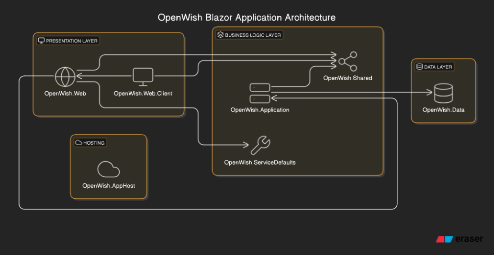

# Development Guide

## Solution Design

<sub><i>Generated by eraser.io/diagramgpt</i></sub>



* `OpenWish.AppHost` - .NET Aspire Host project and contains the main entry point for the application when debugging locally. See [Aspire secrets](#aspire-secrets) for setting up required dev-time secrets.
* `OpenWish.Data` - Contains the EntityFramework Core context and models for the application.
* `OpenWish.Web` - Blazor Server project and API host for the application. This is what eventually is hosted as the main application. 
* `OpenWish.Shared` - Shared models and interfaces between the `OpenWish.Web` and `OpenWish.Web.Client` projects - enabling Blazor Interactive Auto render mode where server renders the initial page using its implementation of `I{Service}` services, and these assemblies are downloaded to client via web assembly to enable client-side interactivity after initial rendering. 
* `OpenWish.Application` - Contains the application services and business logic for the application.
* `OpenWish.ServiceDefaults` - supports the .NET Aspire Host bootstrapping.

## Aspire Secrets

To run a local PostgreSQL instance, you must give a username & password. Use dotnet user secrets for this.

```bash
cd src/OpenWish.AppHost
dotnet user-secrets set Parameters:sqlUser "openwish"
dotnet user-secrets set Parameters:sqlPassword "D0 not use this in prod!"
# (no really, don't)
```

The secret will be passed into `OpenWish.Web` automatically (well, from Aspire).

## EntityFramework Core Changes

The EFCore context is found in the [OpenWish.Data](./src/OpenWish.Data) project as a reference, but the [OpenWish.Web](./src/OpenWish.Web) project owns running the Migrations on Startup. 

### Add Migration

After adjusting EF models and you want to stage a new DB migration, run:

```bash
# from project root, change name of 'Initial' as needed
dotnet ef migrations add Initial -p src/OpenWish.Data -s src/OpenWish.Web
```

> Note: may need `dotnet tool install --global dotnet-ef` if you don't have the EF Core tools installed.

## Secrets Management

Certain components require secret values that shouldn't be in source control -- ever. To solve this for local development, use `dotnet user-secrets`. 

For example, you'll need to set these for Email sending:

```bash
cd src/OpenWish.AppHost

dotnet user-secrets set OpenWishSettings:EmailConfig:SmtpUser myuser
dotnet user-secrets set OpenWishSettings:EmailConfig:SmtpFrom "MyUser <myuser@my-smtp.host.com>"
dotnet user-secrets set OpenWishSettings:EmailConfig:SmtpPass mypass
dotnet user-secrets set OpenWishSettings:EmailConfig:SmtpHost my-smtp.host.com
dotnet user-secrets set OpenWishSettings:EmailConfig:SmtpPort 587
```
