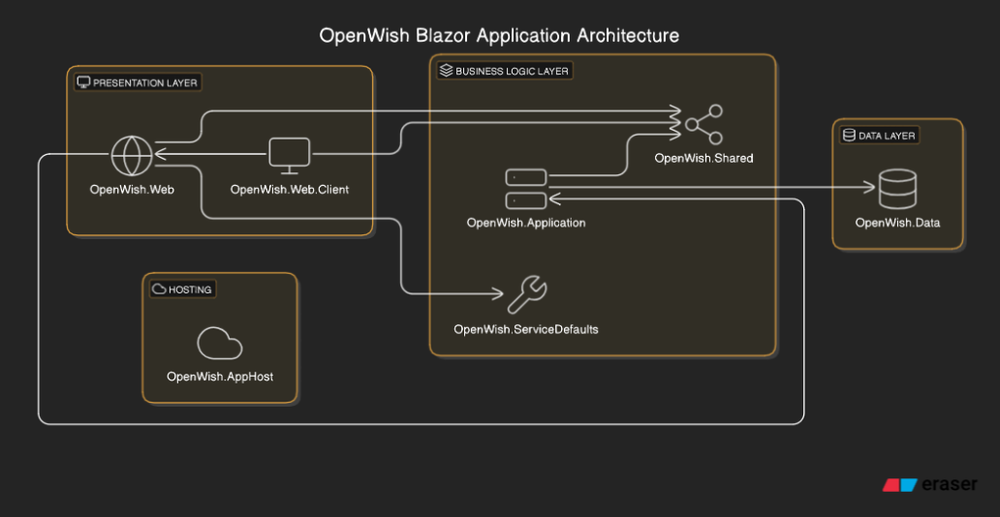

# Development Guide

## Solution Design

<sub><i>Generated by eraser.io/diagramgpt</i></sub>



* `OpenWish.AppHost` - .NET Aspire Host project and contains the main entry point for the application when debugging locally. See [Aspire secrets](#aspire-secrets) for setting up required dev-time secrets.
* `OpenWish.Data` - Contains the EntityFramework Core context and models for the application.
* `OpenWish.Web` - Blazor Server project and API host for the application. This is what eventually is hosted as the main application. 
* `OpenWish.Shared` - Shared models and interfaces between the `OpenWish.Web` and `OpenWish.Web.Client` projects - enabling Blazor Interactive Auto render mode where server renders the initial page using its implementation of `I{Service}` services, and these assemblies are downloaded to client via web assembly to enable client-side interactivity after initial rendering. 
* `OpenWish.Application` - Contains the application services and business logic for the application.
* `OpenWish.ServiceDefaults` - supports the .NET Aspire Host bootstrapping.

## Aspire Secrets

To run a local PostgreSQL instance, you must give a username & password. Use dotnet user secrets for this.

```bash
cd src/OpenWish.AppHost
dotnet user-secrets set Parameters:sqlUser "openwish"
dotnet user-secrets set Parameters:sqlPassword "D0 not use this in prod!"
# (no really, don't)
```

The secret will be passed into `OpenWish.Web` automatically (well, from Aspire).

## EntityFramework Core Changes

The EFCore context is found in the [OpenWish.Data](./src/OpenWish.Data) project as a reference, but the [OpenWish.Web](./src/OpenWish.Web) project owns running the Migrations on Startup. 

### Add Migration

After adjusting EF models and you want to stage a new DB migration, run:

```bash
# from project root, change name of 'Initial' as needed
dotnet ef migrations add Initial -p src/OpenWish.Data -s src/OpenWish.Web
```

> Note: may need `dotnet tool install --global dotnet-ef` if you don't have the EF Core tools installed.

## Secrets Management

Certain components require secret values that shouldn't be in source control -- ever. To solve this for local development, use `dotnet user-secrets`. 

For example, you'll need to set these for Email sending:

```bash
cd src/OpenWish.AppHost

dotnet user-secrets set OpenWishSettings:EmailConfig:SmtpUser myuser
dotnet user-secrets set OpenWishSettings:EmailConfig:SmtpFrom "MyUser <myuser@my-smtp.host.com>"
dotnet user-secrets set OpenWishSettings:EmailConfig:SmtpPass mypass
dotnet user-secrets set OpenWishSettings:EmailConfig:SmtpHost my-smtp.host.com
dotnet user-secrets set OpenWishSettings:EmailConfig:SmtpPort 587
```

## Docker Build Locally

```bash
# bash
cd src/

GIT_SHA=$(git rev-parse --short HEAD)
BUILD_YEAR=$(date -u +"%Y")
BUILD_MONTH=$(date -u +"%m")
BUILD_VERSION="$BUILD_YEAR.$BUILD_MONTH"
TAG_NAME="$BUILD_YEAR$BUILD_MONTH"

echo "Building with:"
echo "GIT_SHA: $GIT_SHA"
echo "BUILD_VERSION: $BUILD_VERSION"
echo "TAG_NAME: $TAG_NAME"

docker buildx build \
  --build-arg GIT_SHA=$GIT_SHA \
  --build-arg BUILD_VERSION=$BUILD_VERSION \
  --file OpenWish.Web/Dockerfile \
  --tag openwishlocal:latest \
  --tag openwishlocal:$TAG_NAME \
  .
```

and to run the image...

```bash
# bash
docker run --rm \
  -e "ASPNETCORE_ENVIRONMENT=Development" \
  -e "TZ=America/Chicago" \
  -e "ConnectionStrings__OpenWishContext=Host=localhost;Database=openwish;Username=openwish;Password=dev" \
  -p 8080:80 \
  openwishlocal:$TAG_NAME
```

## Automated verification

Run the complete local gate from the repository root:

```bash
cd src
dotnet format --verify-no-changes
dotnet build
dotnet test
cd ..
scripts/verify-e2e.sh
```

The E2E script creates an isolated PostgreSQL and OpenWish stack with a unique
Compose project name, enables synthetic login and fixtures only in that
Development environment, and runs the committed Playwright journey. It
verifies the owner, guest, and friend perspectives across every main route,
including authorization boundaries, gift assignments, reservations,
notifications, account settings, theme persistence, and mobile rendering.
Machine-readable results are written to `.docs/images/verification/`, and the
README walkthrough is regenerated under `.docs/images/walkthrough/`.

See [SCREENSHOTS.md](SCREENSHOTS.md) for where permanent documentation,
pull-request evidence, and release assets belong.

## Isolated agent environment

The agent-managed environment is separate from the Aspire development
resources. By default, it uses Compose project `openwish-agent`, web port
`9090`, PostgreSQL port `55433`, database `OpenWishAgent`, and its own persistent
volume. It does not connect to or update the PostgreSQL container, network,
volume, or web port used by `OpenWish.AppHost`.

Copy `.env.agent.example` to `.env.agent` to change those local-only defaults.
The file is ignored so credentials and machine-specific ports are not
committed.

```bash
# Verify the candidate, then promote it to http://localhost:9090.
scripts/agent-environment.sh deploy

# Inspect the isolated environment.
scripts/agent-environment.sh status
scripts/agent-environment.sh logs

# Stop containers without removing agent data.
scripts/agent-environment.sh stop

# Explicitly remove the isolated database volume and containers.
scripts/agent-environment.sh reset
```

Deployment is lock-protected. It first runs the ephemeral E2E gate, builds a
candidate image, and updates only the agent Compose project after verification
succeeds. After the health check, it idempotently loads the same synthetic
owner, guest, friend, wishlist, event, and collaboration data used by the
browser suite. A failed verification leaves the running agent environment
unchanged; a failed post-promotion health or data check restores the previous
image. This lets an agent work and validate changes while the normal Aspire
instance continues independently.
