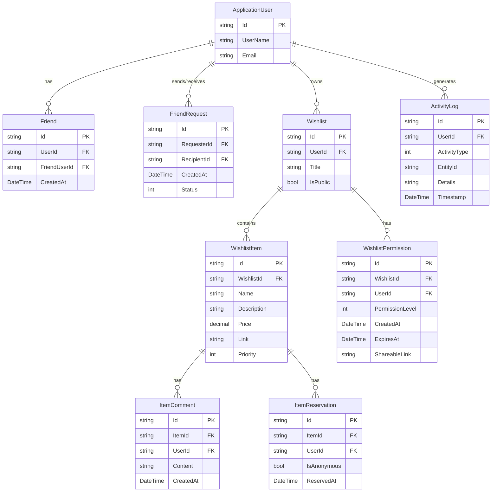
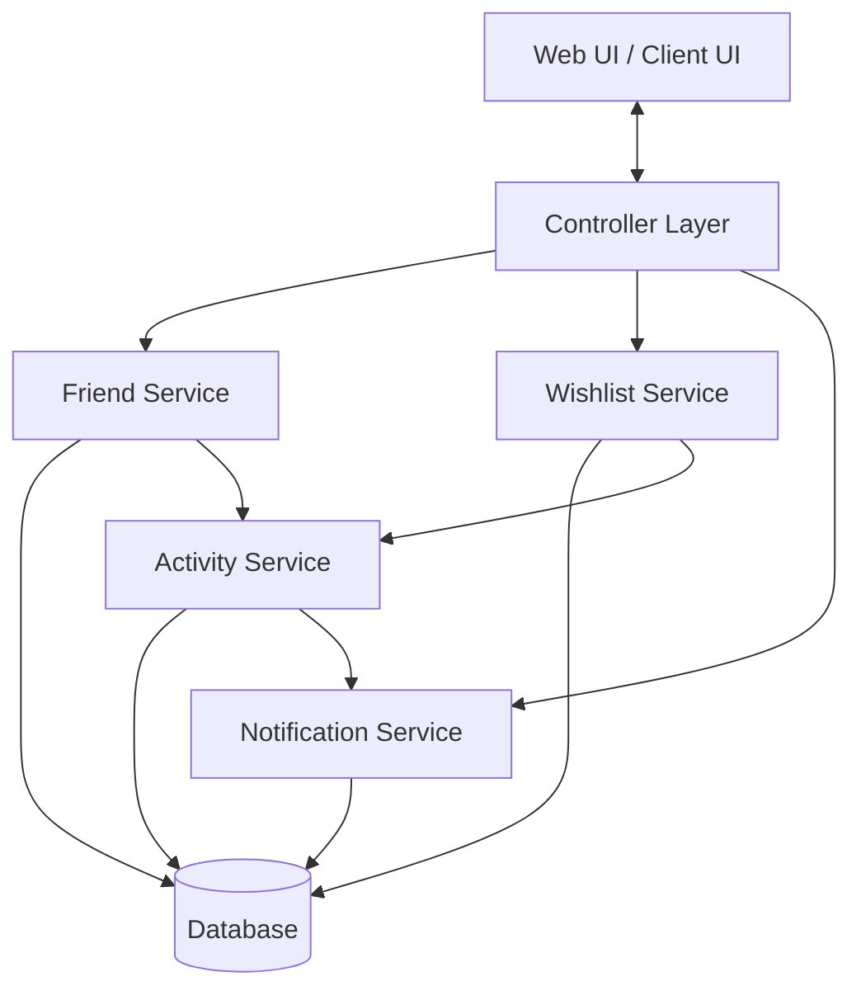
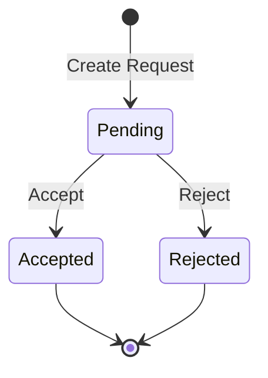
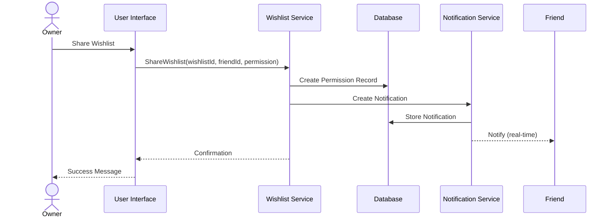
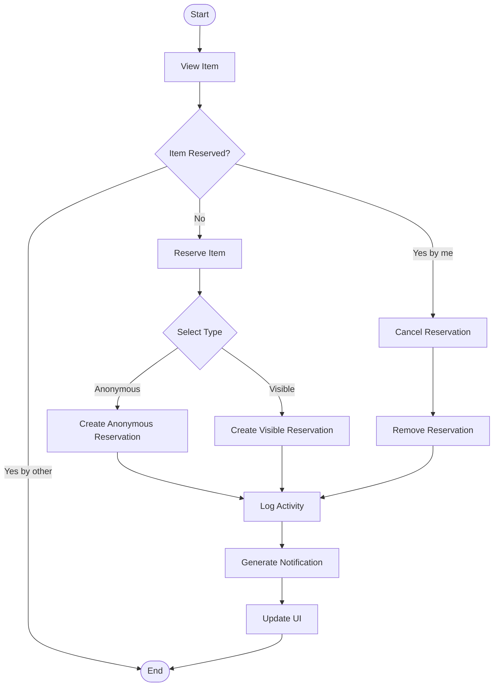
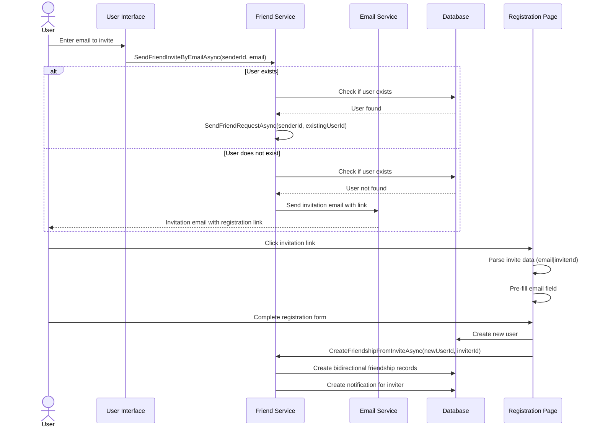

# Technical Implementation Details: Social Features

This document outlines the technical implementation of social features in OpenWish, including entity relationships, service architecture, and data flow.

## Entity Relationship Diagram

## Service Architecture

## Friend Request State Diagram

## Wishlist Sharing Sequence Diagram

## Item Reservation Process

## Technical Components

### Friend Management
- `FriendService` implements `IFriendService` with methods for:
  - Sending friend requests
  - Accepting/rejecting requests
  - Retrieving friend lists
  - Searching for potential friends
  - Sending email invitations
  - Creating friendships from email invitations
- Friend relationships are bi-directional with a single record

### Email Invitation Flow

### Wishlist Sharing
- `WishlistPermission` entity stores:
  - Direct user permissions
  - Shareable link tokens (when generated)
  - Permission expiration dates
  - Access level (view/edit)
- URL-based sharing uses secure tokens with configurable expiration

### Item Interactions
- Comments implement a simple thread model with creation timestamps
- Reservations track the reserving user and anonymity preferences
- Changes trigger activity logs and notifications

### Activity Logging
- `ActivityService` centrally logs all social interactions
- Entries include:
  - User ID
  - Activity type (enum)
  - Entity reference (item, wishlist, etc.)
  - Timestamp
  - Additional context

### Notification System
- Real-time notifications via SignalR
- Persistent storage for history
- Types include:
  - Friend requests
  - Wishlist shares
  - Item comments
  - Item reservations