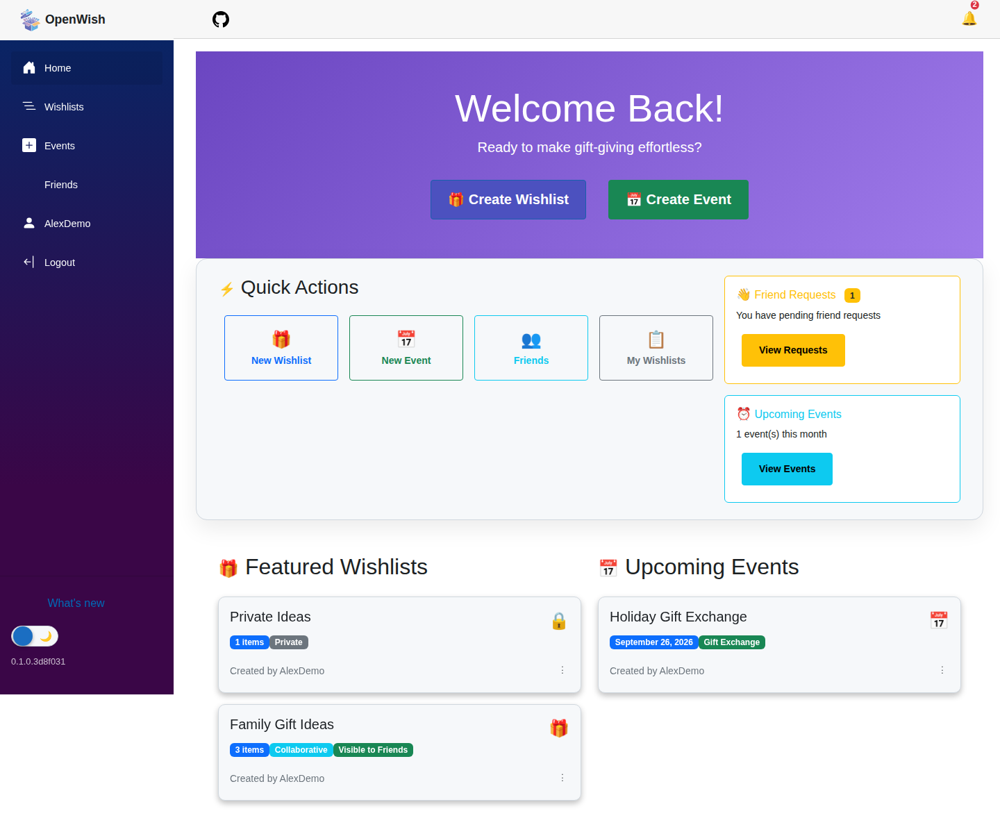
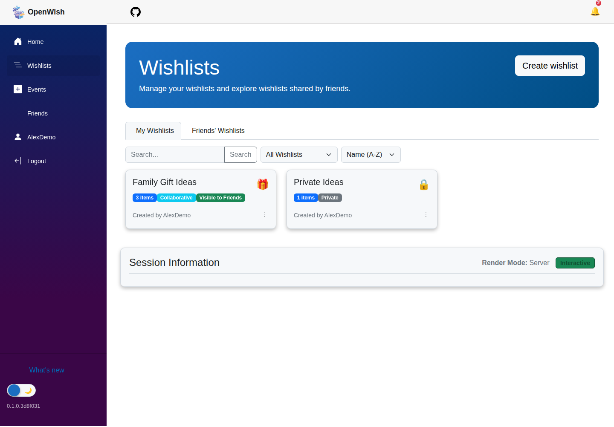
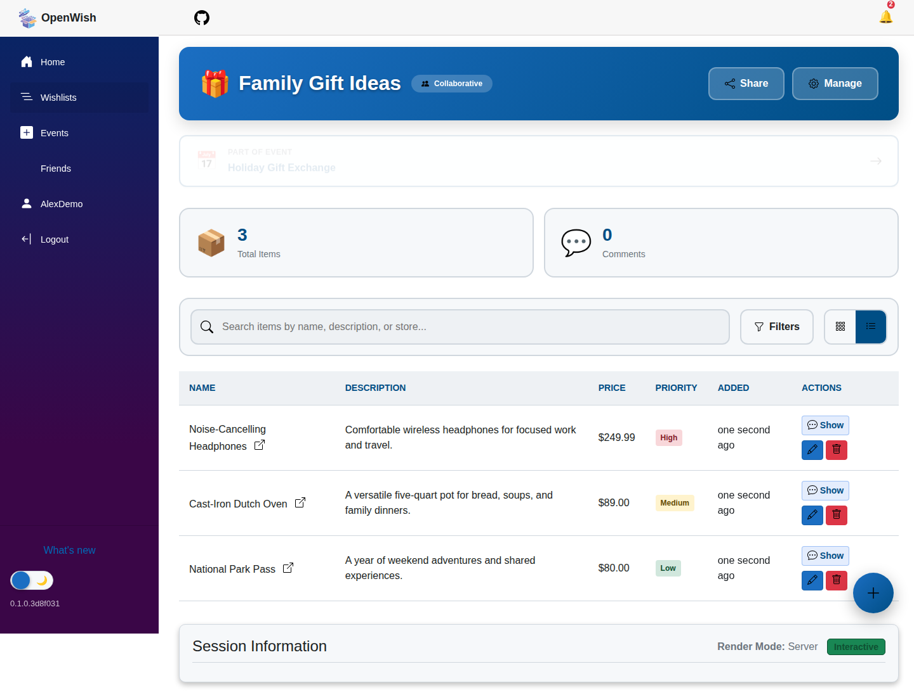
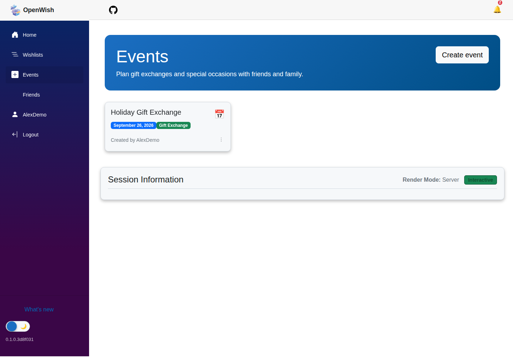
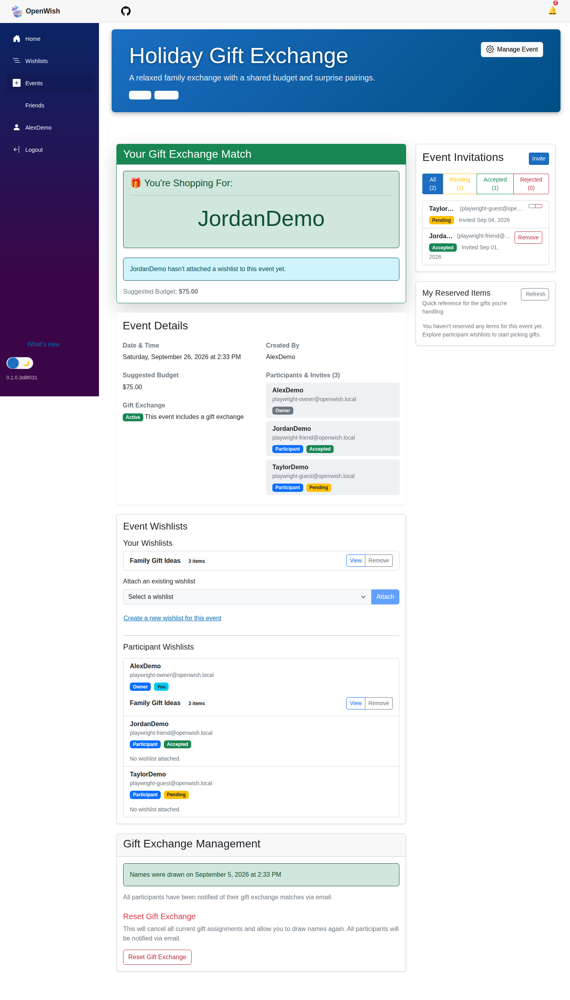
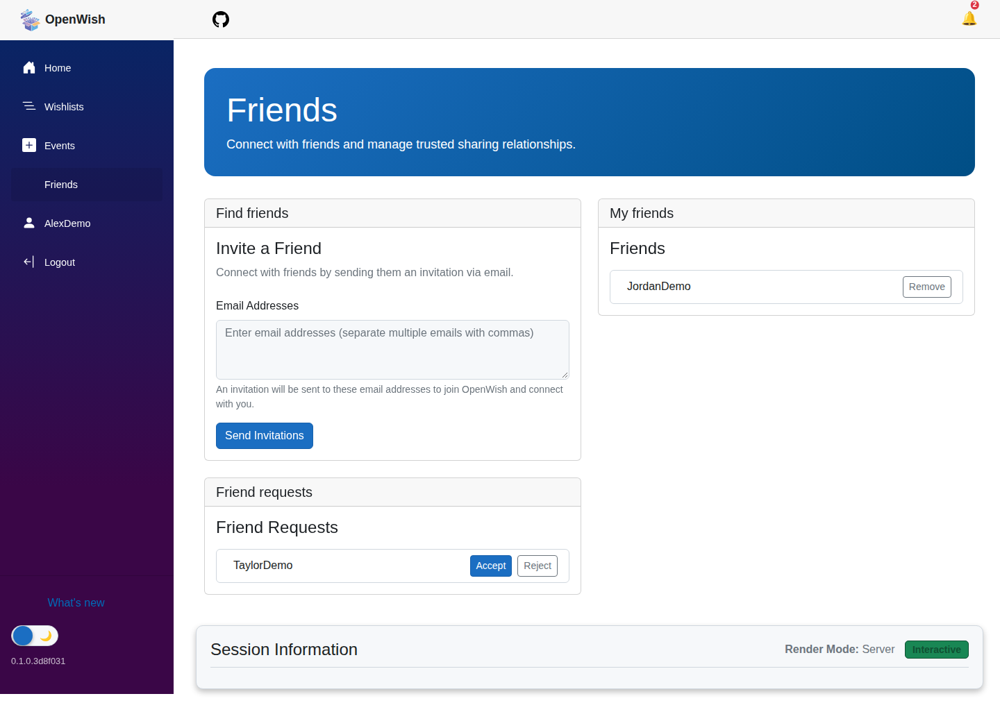
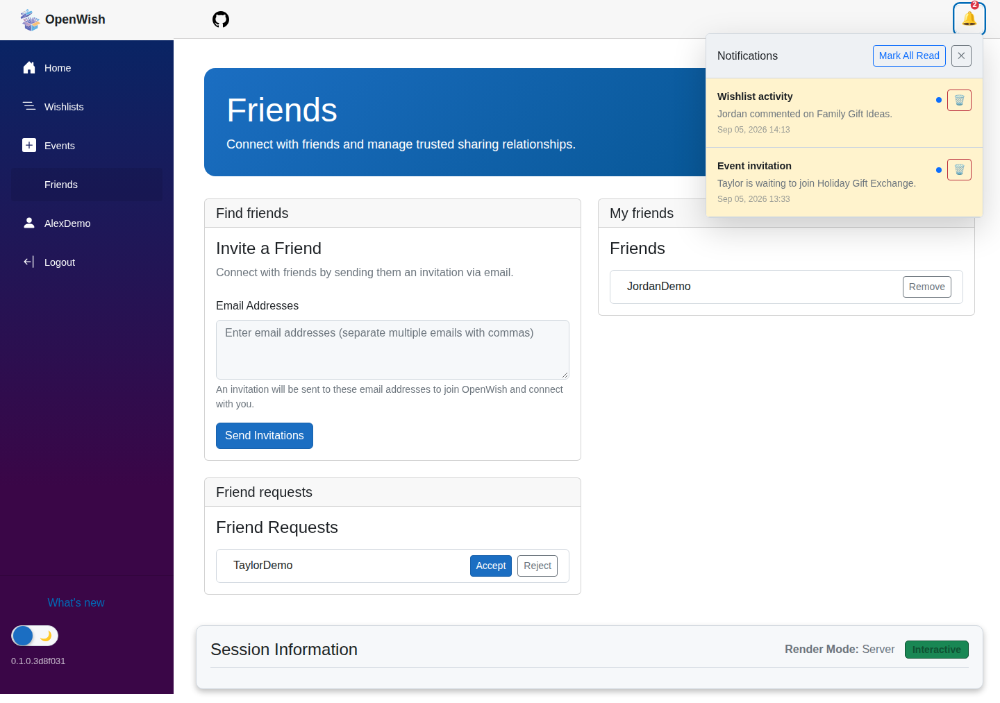
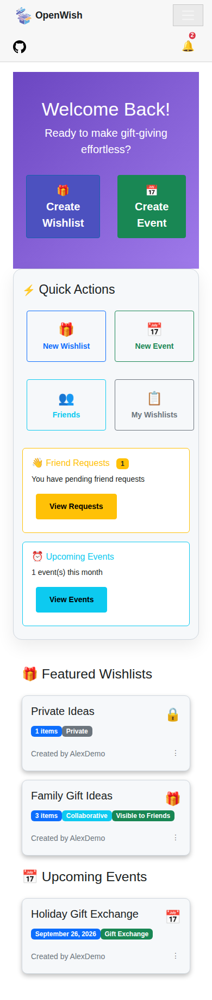

#  OpenWish

Self-hosted wishlists, gift exchanges, and private gift coordination for
families and groups.

* [.NET 10](https://dot.net/)
* Blazor App (Server & Client WebAssembly)
* Entity Framework Core managed data on PostgreSQL
* Docker images [published](https://github.com/mitch-b/OpenWish/pkgs/container/openwish-web)



## A walkthrough of OpenWish

### Keep every gift idea organized

Create as many lists as you need, choose private or collaborative visibility,
and add gift ideas with descriptions, prices, purchase links, stores, and
priorities. Friends' public lists stay close at hand without mixing them into
your own.



Each list has focused item search, priority and price filters, grid and list
views, comments, and sharing controls. Gift reservations are visible to the
people coordinating a purchase but hidden from the list owner, preserving the
surprise.



### Plan birthdays, holidays, and Secret Santa

Create an event, invite participants, set a date and suggested budget, and
attach participant wishlists. Event cards keep upcoming celebrations visible
from both the dashboard and the dedicated event view.



For gift exchanges, OpenWish draws names and reveals each participant's
assignment privately. The event owner can manage participants and invitations,
while each participant sees only the match and reservation details relevant to
them.



### Coordinate with people you trust

Find other OpenWish users, send or respond to friend requests, and control who
can see a list. Comments, reactions, and anonymous reservations let a group
coordinate without revealing the gift to its recipient.



Notifications bring invitations and wishlist activity into one place.



### Use it wherever planning happens

The responsive interface works on phones and desktops. It includes a
light/dark theme with automatic system preference detection and a persistent
manual toggle.



Account settings, release highlights on the **What's new** page, and
authenticated access controls round out the hosted experience.

## Developing

[](https://codespaces.new/mitch-b/OpenWish)

See the [development guide](.docs/DEVELOPING.md) for local setup, automated
browser verification, and the isolated agent-managed environment. Read
[`PRODUCT_DIRECTION.md`](PRODUCT_DIRECTION.md) for the principles used to
evaluate contributions.

## Installation

### Docker Compose

Since OpenWish depends on an external datasource (PostgreSQL), if you don't already have a PostgreSQL instance to use, you can run an instance alongside the OpenWish application using Docker Compose:

```yaml
services:
  sql:
    image: postgres:18
    container_name: openwish-postgres
    environment:
      POSTGRES_USER: "openwish"
      POSTGRES_PASSWORD: "YourStrong!Passw0rd"
      POSTGRES_DB: "OpenWish"
    volumes:
      - openwish-data:/var/lib/postgresql
    ports:
      - 5432:5432

  web:
    image: ghcr.io/mitch-b/openwish-web:latest
    container_name: openwish-web
    environment:
      - TZ=America/Chicago
      - ConnectionStrings__OpenWish=Server=sql;Port=5432;Database=OpenWish;User Id=openwish;Password=YourStrong!Passw0rd;
      - OpenWishSettings__OwnDatabaseUpgrades=true
    ports:
      - 5001:8080
    depends_on:
      - sql

volumes:
  openwish-data:
```

See [package versions](https://github.com/mitch-b/OpenWish/pkgs/container/openwish-web/versions) for published tags. Use `{year}{month}` tags (for example, `202601`) to manage upgrades.

## License

This project is licensed under the Apache License 2.0 - see the [LICENSE](LICENSE) file for details.
