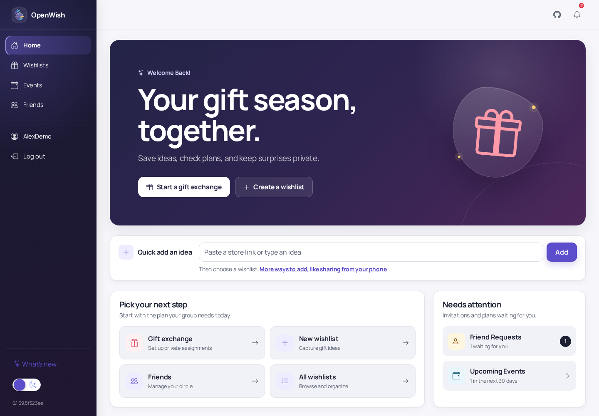
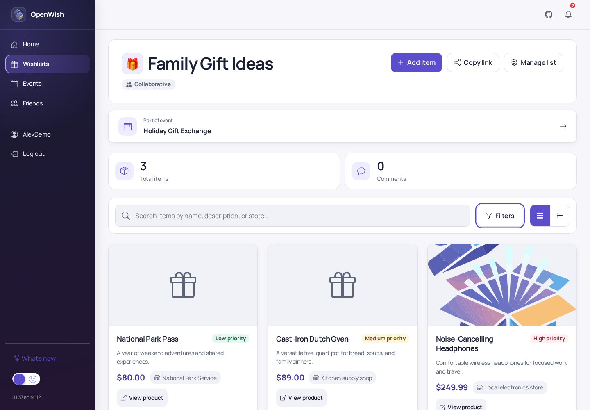
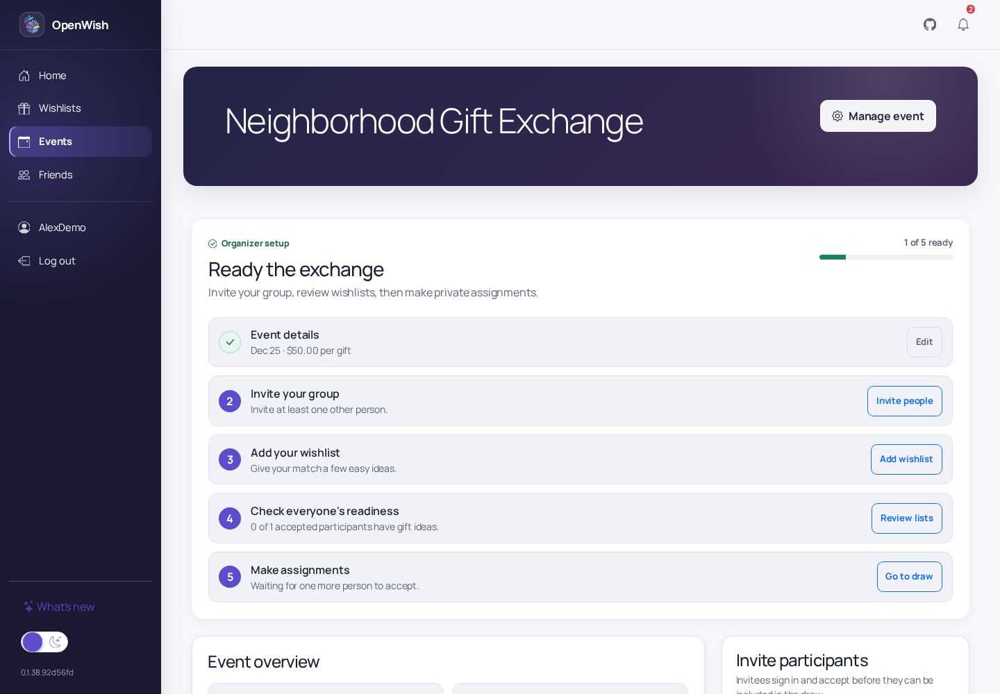
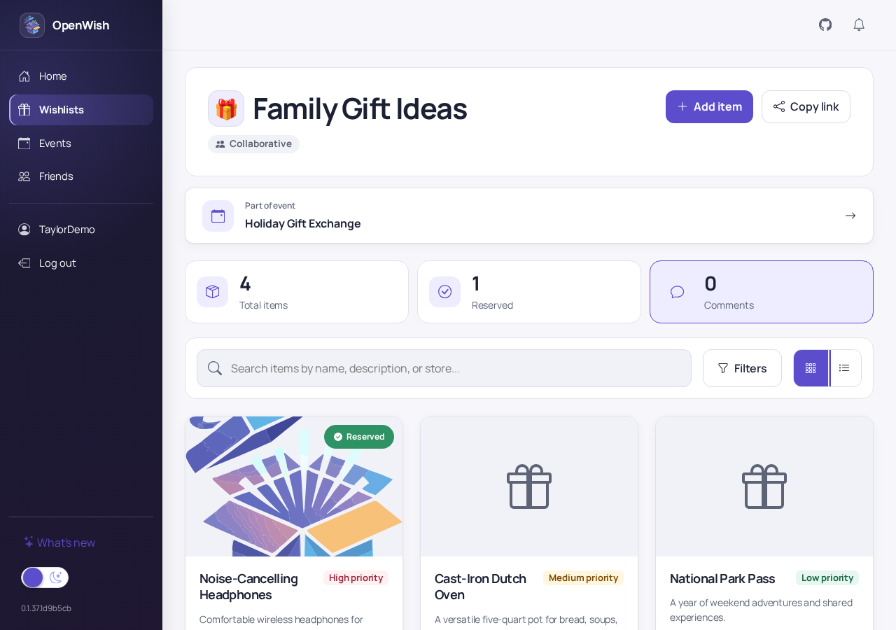
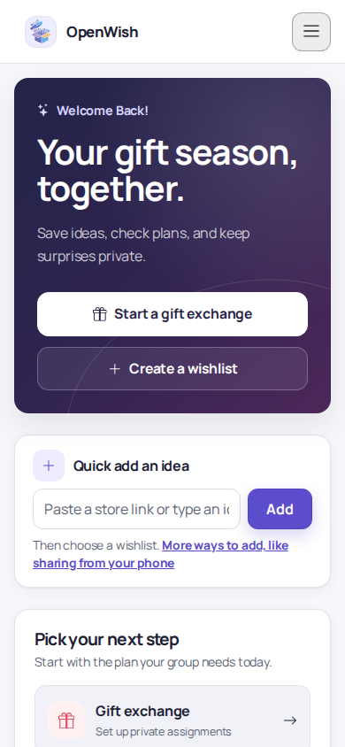

#  OpenWish

**Thoughtful gift giving, without duplicate purchases or spoiled surprises.**

OpenWish is a self-hosted home for the wishlists, private gift coordination,
and name draws that make a small group's celebrations feel easy. Keep the
planning with the people you trust—not a marketplace, ad network, or public
profile.

[Explore the product story](#one-gift-season-one-calm-place) ·
[Run it yourself](#installation) ·
[See how it is built](.docs/DEVELOPING.md)



## One gift season, one calm place

The screenshots below follow a fictional group planning a holiday exchange:
Alex collects a few meaningful ideas, Jordan shares a wishlist, Taylor is
waiting on an invitation, and everyone can coordinate a gift without revealing
it to its recipient. They use synthetic data generated by the committed
browser journey—never real user information.

### Start with an idea, not a spreadsheet

Save the useful details as soon as you have them: a product link, a price,
where to buy it, and how much it matters. Lists can be private, shared with
friends, or connected to an exchange. Search and filters keep a growing list
useful when the moment to shop arrives.



### Turn a group plan into a private exchange

Create an event for a holiday, birthday, team, or tradition. Invite existing
friends or send a shareable link, see who has accepted, and make assignments
only when the group is ready. The familiar Secret Santa style is available
when that is the language your group already uses.



### Shop together without giving the game away

Every person sees the perspective they need: an organizer sees readiness, a
participant sees their match, and a shopper sees gift ideas. Reservations,
comments, and purchase activity stay hidden from the person receiving the
gift, so coordination does not ruin the surprise.



### Built for the moment you are actually planning

OpenWish is comfortable on a kitchen-table laptop and on the phone in a store
aisle. The same clear hierarchy, wishlists, exchange details, and privacy
boundaries carry across screen sizes, with light and dark themes available.



## What OpenWish gives your group

| When you need to… | OpenWish helps you… |
|---|---|
| Remember gift ideas | Capture a link or a note now, then organize it by priority, price, and list. |
| Share safely | Choose private, friend-only, or collaborative wishlists without public discovery. |
| Run a name draw | Invite people, track responses, connect wishlists, and reveal assignments privately. |
| Avoid duplicates | Reserve an idea or leave a comment without exposing the plan to its recipient. |
| Keep ownership | Run the application and PostgreSQL database yourself with standard Docker tooling. |

## Made for small-group trust

- **No public profiles or marketplace pressure.** OpenWish is for the people
  you already know.
- **Privacy is part of the product.** Viewer-specific controls protect private
  items, reservations, comments, and name-draw assignments.
- **A complete mobile workflow.** Capture an idea, check a match's wishlist,
  and coordinate a purchase from the same responsive interface.
- **Self-hosted by design.** Your wishlists and group plans live in your own
  PostgreSQL database, with documented configuration and upgrade behavior.

## Built with dependable, portable tools

OpenWish is an ASP.NET Core [.NET 10](https://dot.net/) application with Blazor
server rendering and interactive WebAssembly, PostgreSQL via Entity Framework
Core, and published Docker images. It is designed to be understandable to the
person who runs it as well as useful to the people who use it.

Docker images are [published on GitHub](https://github.com/mitch-b/OpenWish/pkgs/container/openwish-web).

## Developing

[](https://codespaces.new/mitch-b/OpenWish)

See the [development guide](.docs/DEVELOPING.md) for local setup, automated
browser verification, and the isolated agent-managed environment. Read
[`PRODUCT_DIRECTION.md`](PRODUCT_DIRECTION.md) for the principles used to
evaluate contributions.

## Installation

### Docker Compose

Since OpenWish depends on an external datasource (PostgreSQL), if you don't already have a PostgreSQL instance to use, you can run an instance alongside the OpenWish application using Docker Compose:

```yaml
services:
  sql:
    image: postgres:18
    container_name: openwish-postgres
    environment:
      POSTGRES_USER: "openwish"
      POSTGRES_PASSWORD: "YourStrong!Passw0rd"
      POSTGRES_DB: "OpenWish"
    volumes:
      - openwish-data:/var/lib/postgresql
    ports:
      - 5432:5432

  web:
    image: ghcr.io/mitch-b/openwish-web:latest
    container_name: openwish-web
    environment:
      - TZ=America/Chicago
      - ConnectionStrings__OpenWish=Server=sql;Port=5432;Database=OpenWish;User Id=openwish;Password=YourStrong!Passw0rd;
      - OpenWishSettings__OwnDatabaseUpgrades=true
    ports:
      - 5001:8080
    depends_on:
      - sql

volumes:
  openwish-data:
```

See [package versions](https://github.com/mitch-b/OpenWish/pkgs/container/openwish-web/versions) for published tags. Use `{year}{month}` tags (for example, `202601`) to manage upgrades.

## License

This project is licensed under the Apache License 2.0 - see the [LICENSE](LICENSE) file for details.
